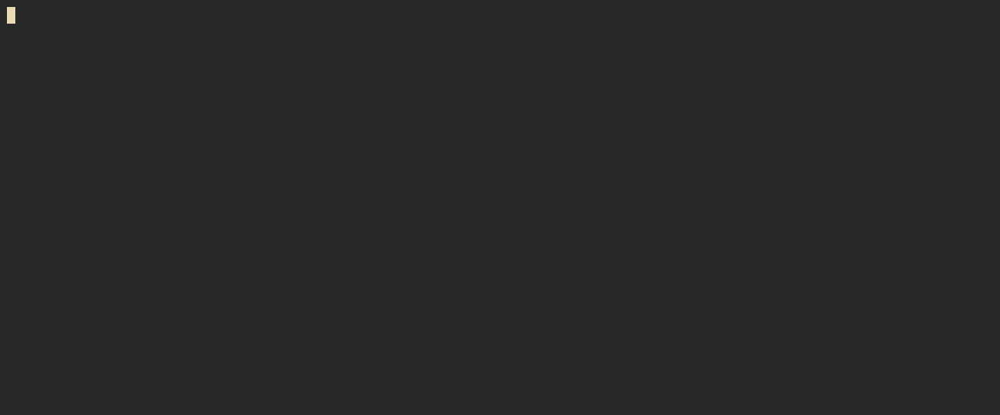

# 🕵️‍♂️ Python Scraping Alert Engine
<p align="center">
  
  
  
  
  
  
</p>

Python automation tool to monitor websites, detect new items and optionally send real-time alerts on Telegram/Discord.

Built as a **freelance-grade automation template**: config-driven, extensible, deployable with Docker, and built-in logging.

## ✨ Features

| Feature | Status |
|---|---|
Config-based scraping targets (`config.yaml`) | ✅
Multi-site scraping | ✅
Duplicate-safe storage (CSV) | ✅
Automatic new item detection | ✅
Telegram & Discord alerts | ✅ (via `.env`)
Retry/backoff HTTP calls | ✅
Logging to file + console | ✅ (`logs/app.log`)
Interactive CLI menu | ✅
Docker & Compose support | ✅
Offline local run | ✅

## 📂 Project Structure

```
.
├── monitor.py            # main app
├── config.yaml           # scraping rules
├── Dockerfile
├── docker-compose.yml
├── data/                 # CSV output (auto-created)
└── logs/                 # logs/app.log (auto-created)
```

## ⚙️ Configuration

### Targets (`config.yaml`)

```yaml
storage:
  csv_path: "data/output.csv"
  unique_key: "link"

alerts:
  enabled: false

targets:
  - name: "hn_new"
    url: "https://news.ycombinator.com/newest"
    item: ".athing"
    fields:
      title: ".titleline a::text"
      link: ".titleline a::attr(href)"
    csv_path: "data/hn_new.csv"
```

### 🔐 Environment variables (`.env`)

```
TELEGRAM_BOT_TOKEN=...
TELEGRAM_CHAT_ID=...
DISCORD_WEBHOOK_URL=...
```

Leave them empty to run without alerts.

> Alert toggling in the app currently only affects runtime — config is not edited (Docker mounts it read-only).  

## ▶️ Usage



### Run normally
```
python monitor.py
```

### CLI features
- Scrape all sites
- Select target
- Dry-run (no CSV write / no alerts)
- Limit number of scraped items
- Toggle alerts (runtime only)

## 🐳 Docker

### Build
```
docker compose build
```

### Interactive mode (menu)
```
docker compose run autoscrape
```

## 📦 What this project demonstrates

✅ Python automation  
✅ Scraping static sites without heavy browsers  
✅ Config-driven workflow  
✅ Logging + structured output  
✅ Telegram/Discord alerting  
✅ Docker deployment  
✅ Interactive CLI for end‑users  

A **modular automation engine**, ideal for:

- Job monitoring
- Lead generation
- Product drop alerts
- Market intelligence bots
- Internal automation scripts for clients

## 🚧 Roadmap

| Next idea | Status |
|---|---|
Persist alert settings | 🔜  
Add FastAPI dashboard | 🔜  
SQLite history | 🔜  
Webhook trigger mode | 🔜  

## 👤 Author

Made by **Charles Baux**  
- GitHub: https://github.com/charlesbx  
- Focus: automation, scraping, bots & internal tools

⭐ Star the project if you like it!
